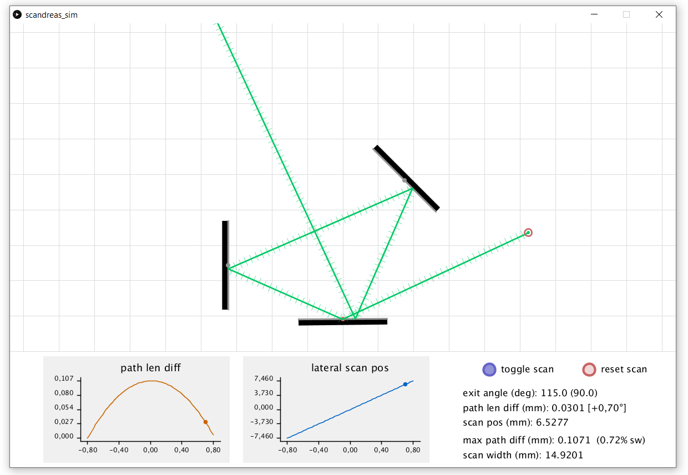

# scandreas-sim
An interactive simulator for the **scandreas** scanning setup (and related mirror-laser-y stuff), written in Processing.

The **scandreas** setup was conceived by Andreas Boden, Andrea Volpato, Kayley Hake, Andrew York and Ilaria Testa, 
and was presented by @AndrewGYork in [this tweet](https://twitter.com/AndrewGYork/status/1222319044755197952), which can be referenced using https://zenodo.org/record/3653386 .

This simulator started out of curiosity, and as an excersise, to try to undertand the workings and properties of the setup in an interactive manner, and grew as new ideas and concepts were discussed in the thread that unfolded from the original tweet.

Feel free to play with it, mess around, and modify it as you like!

## Documentation:

### Installation:
- Just download the `scandreas_sim/` folder, and open and run `scandreas_sim.pde` in the [Processing IDE](https://processing.org/download/).

### Basic usage:
Upon start, the user is presented with a canvas with several objects: three mirrors and a laser source. Each has a small dot that acts as a handle. At any time, the active object will be marked with a red circle around that dot.

#### Mirrors
Each mirror has a reflective (gray) and a non-reflective (black) side, and can be repositioned by clicking and dragging from the center dot. 
A mirror can be rotated by clicking and dragging near either end. While dragging, the cursor can be moved away from the mirror to achieve better precision.
The mirror marked with a red dot scans back and forth (default range = +/- 0.8°)

There are two buttons, one to start/stop scanning, and one to reset the scan mirror to center. This is useful to fine-tune the centering of a particular arrangement.

#### Laser
The laser source can be moved in a similar way as the mirrors. The beam of the laser can be redirected by clicking on the first ray segment (before any bounce/hit) and dragging.

The beam path has regularly spaced markings along its (unfolded) length.

#### Measurements and plots

The canvas is scaled in millimeters (mm). The default mirror width is 50 mm.

On the bottom right of the window, the following information is provided:
- Angle of the exit beam, and the angle that it forms with the input beam (in parenthesis).
- Beam path length difference: this is the difference bethween the minimal length and the current length, always measured from the source to either: 1) an off-screen target that is a fixed distance from the canvas center and always perpendicular to the exit beam, 2) a terminating point, i.e. it hits the back of a mirror. Following any change in the ray path, this quantity will be meaningles until two full scan cycles have elapsed. The corresponding scan angle is shown between brackets.
- Lateral scanning position: current distance from the exit beam to the 0°(center) beam. 
- Maximal path lenght difference, and its percentual value compared to the scan width.
- Scan width: it is the distance between the end beam positions in a full scan. This measurement only makes sense if the exit beam has no angular scan component (i.e.: the exit angle is constant).

On the bottom left you'll find two plots: path length difference vs. scan angle, and lateral position vs. scan angle. If any item is moved in the canvas, this plots will take two full scans to stabilize. 

